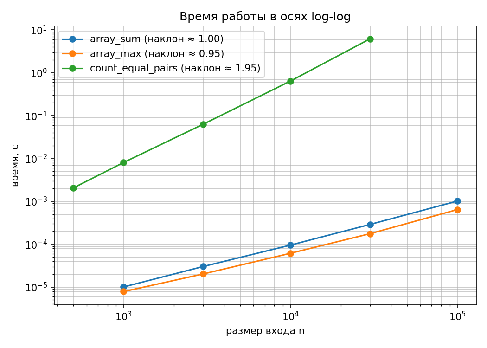
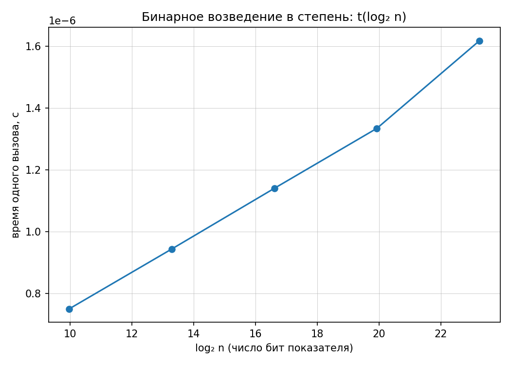

# Лабораторная работа 1. Анализ временной сложности элементарных алгоритмов

**КИМ-01** · **Вариант 2** (seed = 30 + 2 = **32**) · Бирук Павел

Условия замеров: Apple M4 Max, macOS 26; Python 3.13.0, matplotlib 3.10.9;
ноутбук от сети.

## Цель

Определить временную сложность четырёх элементарных алгоритмов аналитически
и подтвердить оценки замерами на данных своего варианта.

## Состав

| Файл | Содержание |
|---|---|
| [`lab01_complexity.py`](lab01_complexity.py) | алгоритмы, самопроверка, замеры |
| [`lab01_longarith_demo.py`](lab01_longarith_demo.py) | к п. 5: почему замер по модулю |
| [`lab01_slope_check.py`](lab01_slope_check.py) | три гипотезы к разбору расхождения наклонов |
| [`figures/lab01_loglog.png`](figures/lab01_loglog.png) | log-log для степенных алгоритмов |
| [`figures/lab01_binary_pow.png`](figures/lab01_binary_pow.png) | t(log₂ n) для бинарной степени |

Запуск: `make lab01`. Считается несколько минут — квадратичный алгоритм при
n = 30 000 делает около 450 млн сравнений, каждая точка замеряется шесть раз.

Оформление: `make lint` — black без замечаний, pylint 10,00/10.

## Данные варианта

Набор `arrays`: четыре типа массивов (`random`, `sorted`, `reversed`, `dups`)
пяти размеров 1000…100 000. Линейные алгоритмы замеряются на `random`,
квадратичный — на `dups` (узкий диапазон значений, поэтому равных пар много).
Для квадратичного n = 100 000 исключён (порядка 15 минут), пятой точкой взят
префикс на 500 элементов.

## Аналитические оценки

| Алгоритм | Оценка | Обоснование |
|---|---|---|
| `array_sum` | Θ(n), память Θ(1) | один проход, тело O(1), досрочного выхода нет |
| `array_max` | Θ(n), память Θ(1) | n − 1 сравнение; меньше невозможно: непросмотренный элемент мог бы быть наибольшим |
| `count_equal_pairs` | Θ(n²) | (n−1) + (n−2) + … + 1 = n(n−1)/2 сравнений |
| `binary_pow` | Θ(log n) умножений | показатель делится пополам, итераций = число битов n |

У всех четырёх оценки **точные (Θ), а не только O**: число операций не
зависит от значений, лучший и худший случаи совпадают.

Задача счёта пар решается и за Θ(n): значение с k повторами даёт k(k−1)/2 пар.
Линейная версия реализована (`count_equal_pairs_by_freq`), но **как эталон для
сверки** — замеряется двойной цикл, как требует задание.

Для `binary_pow` Θ(log n) — это число **умножений**, а не элементарных
операций: целые в Python неограниченной длины. Отсюда замер по модулю.

## Верификация

Методика курса — четыре шага, все выполнены:

| Шаг | Что сделано | Где |
|---|---|---|
| 1. Инварианты | сумма не зависит от порядка; максимум принадлежит массиву; x^(p+q) = x^p·x^q | `check_*_invariants` |
| 2. Репрезентативные тесты | пустой массив, один элемент, все элементы равны, границы степеней двойки, `mod = 1`, отрицательный показатель | там же и `self_check` |
| 3. Сверка с эталоном | `sum`, `max`, трёхаргументный `pow`, линейный подсчёт пар через частоты | `self_check`, `check_pairs_invariants` |
| 4. Сложность и производительность | аналитические оценки и замеры, наклоны сопоставлены с теорией | разделы ниже |

### Собственные проверки инвариантов

Сверх проверок заготовки (сверка с `sum`, `max`, `pow` на случайных данных):

| Проверка | Что проверяет |
|---|---|
| `check_pairs_invariants` | различные элементы → 0 пар; k одинаковых → k(k−1)/2; сверка двойного цикла с линейным эталоном на 300 массивах |
| `check_sum_max_invariants` | сумма не зависит от порядка; максимум лежит в массиве и не меньше всех; один элемент и все равные, в том числе отрицательные; `array_max([])` → `ValueError`, как у `max([])` |
| `check_binary_pow_invariants` | x^(p+q) = x^p·x^q (mod m) на 200 тройках; границы степеней двойки; `mod = 1`; отрицательный показатель и нулевой модуль |

Две детали.

**Эталон написан по другому принципу.** Для счёта пар сверка идёт с линейной
реализацией через частоты. Повтори я в эталоне тот же двойной цикл, сверка
подтверждала бы лишь воспроизводимость ошибки.

**Граничный случай `mod = 1`.** Прямолинейная реализация начинает с
`result = 1` и при n = 0 возвращает 1, тогда как `pow(x, 0, 1)` даёт 0.
Расхождение ровно на одном входе, который случайная генерация не порождает.
В реализации `result = 1 % mod`, проверка закрывает случай.

Проверки оформлены явными исключениями, а не `assert`: `assert` отключается
при `python -O`.

### Вывод о применимости

**Принять.** Все проверки проходят, результаты совпадают с эталонами,
измеренные наклоны совпадают с аналитическими оценками в пределах
объяснённой погрешности. Шаг 4 — тот, который ловит асимптотически худшую
реализацию: подсчёт пар через частоты и двойной цикл дают одинаковый ответ,
и отличить их можно только замером.

## Результаты

### Линейные алгоритмы

| n | `array_sum`, мкс | нс/эл. | `array_max`, мкс | нс/эл. |
|---:|---:|---:|---:|---:|
| 1 000 | 11 | 11,0 | 10 | 10,0 |
| 3 000 | 31 | 10,3 | 22 | 7,3 |
| 10 000 | 97 | 9,7 | 65 | 6,5 |
| 30 000 | 281 | 9,4 | 181 | 6,0 |
| 100 000 | 982 | 9,8 | 576 | 5,8 |

### Квадратичный алгоритм

| n | время, с | сравнений | нс/сравнение |
|---:|---:|---:|---:|
| 500 | 0,00206 | 124 750 | 16,5 |
| 1 000 | 0,00817 | 499 500 | 16,4 |
| 3 000 | 0,0611 | 4 498 500 | 13,6 |
| 10 000 | 0,6327 | 49 995 000 | 12,7 |
| 30 000 | 6,1414 | 449 985 000 | 13,6 |

Рост n в 60 раз увеличил время в **2981 раз** при квадрате отношения 3600.
Нормировка на число сравнений даёт почти постоянные 12,7–16,5 нс.

### Бинарное возведение в степень

| n | log₂ n | нс на вызов |
|---:|---:|---:|
| 10³ | 10,0 | 756 |
| 10⁴ | 13,3 | 955 |
| 10⁵ | 16,6 | 1172 |
| 10⁶ | 19,9 | 1360 |
| 10⁷ | 23,3 | 1679 |

Линейная аппроксимация t = a·log₂n + b: **a = 67,8 нс на бит**, b = 58,9 нс,
**R² = 0,990**. Рост показателя в 10 000 раз дал рост времени в 2,22 раза.

## Наклоны и разбор расхождений

| Алгоритм | Теория | Все 5 точек | 3 крупнейшие |
|---|---:|---:|---:|
| `array_sum` | 1,0 | 0,980 | ≈ 1,01 |
| `array_max` | 1,0 | 0,893 | ≈ 0,95 |
| `count_equal_pairs` | 2,0 | 1,940 | ≈ 2,00 |

Все наклоны ниже теоретических, сильнее всего у `array_max`. Проверил три
гипотезы замерами — [`lab01_slope_check.py`](lab01_slope_check.py), значения
ниже с одного запуска.

**1. Накладные расходы на вызов.** Вызов на пустом массиве стоит **35 нс**;
при n = 1000 это 0,3% от времени замера. **Не объясняет.**

**2. Разные точки — разные файлы данных.** В основном замере каждому n
соответствует свой файл. Повторил замер на **префиксах одного массива**:

| n | `array_sum`, нс/эл. | `array_max`, нс/эл. |
|---:|---:|---:|
| 1 000 | 9,50 | 6,83 |
| 10 000 | 9,55 | 5,90 |
| 100 000 | 9,63 | 5,81 |

Наклон на префиксах — 1,003 против 0,980 у суммы и 0,965 против 0,893 у
максимума. Для `array_sum` это объясняет расхождение полностью: время на
элемент постоянно с точностью 1,5%. Для `array_max` — только часть: время на
элемент всё ещё падает с 6,83 до 5,81 нс.

**3. У `array_max` ветвь обновления чаще срабатывает на малых n.** Доля
элементов, на которых максимум обновляется, падает с **0,70%** при n = 1000
до **0,010%** при n = 100 000 (7 и 10 обновлений соответственно — число
обновлений растёт как ln n, а размер входа в 100 раз быстрее). Это остаток
расхождения у максимума и ответ на вопрос, почему у суммы наклон ближе к
единице: у неё такой ветви нет.

**Итог.** Наклоны на трёх крупнейших точках совпадают с теорией. Отклонение
на полном ряду — эффект измерения на малых n, а не другая асимптотика.

**Попутно:** `array_max` быстрее `array_sum` в 1,5–1,7 раза при одинаковом
Θ(n). Причина — `total += value` создаёт новый объект-целое на каждой
итерации (числа ±10⁶ не попадают в кэш малых целых), а сравнение нет.

## Почему линейные оси по log₂ n, а не log-log

Степенная зависимость t = C·n^k даёт на log-log прямую с наклоном k.
Логарифмическая t = a·log n + b даёт кривую, которая при росте n становится
почти горизонтальной. Измеренный наклон `binary_pow` в log-log — **0,085**,
что легко спутать с O(1). В осях (log₂ n, t) зависимость становится прямой,
и коэффициент читается напрямую: 67,8 нс на бит при R² = 0,990.

## Почему замер по модулю

Число x^n имеет около n·log₁₀x цифр, стоимость умножения растёт вместе с
длиной множителей. Замер [`lab01_longarith_demo.py`](lab01_longarith_demo.py):

| n | по модулю, мкс | без модуля, мкс | цифр в ответе |
|---:|---:|---:|---:|
| 1 000 | 0,722 | 1,9 | 478 |
| 10 000 | 0,926 | 82,1 | 4 772 |
| 100 000 | 1,129 | 2 848,3 | 47 713 |

Наклон log-log: **+0,093 по модулю** и **+1,586 без модуля**. Рост n в 100 раз
дал рост времени в 1,56 раза и в **1519 раз** соответственно. Без модуля
алгоритм перестаёт быть Θ(log n) по времени, хотя итераций столько же:
перестаёт выполняться предпосылка «операция стоит O(1)».

## Ответы на вопросы защиты

**1. Асимптотическая сложность; O, Θ, Ω.**
Порядок роста T(n) с точностью до константы: константы зависят от машины,
порядок роста — нет. O(f) — верхняя граница (T ≤ c·f), Ω(f) — нижняя
(T ≥ c·f), Θ(f) — обе сразу. В работе у всех алгоритмов именно Θ: лучший и
худший случаи совпадают. O(n²) для счёта пар формально верно, но слабее —
O(n³) тоже было бы верно, а Θ(n²) нет.

**2. Худший, средний и лучший случаи.**
На множестве входов Dₙ: худший — max{T(x)}, лучший — min{T(x)}, средний —
Σ p(x)·T(x), то есть математическое ожидание при заданном распределении.
Без вероятностной модели средний случай не определён. У всех четырёх
алгоритмов работы три случая совпадают — ни один не завершается досрочно.
Пример, где различаются: линейный поиск (1, n, ≈ n/2).

**3. Почему на log-log степенная зависимость — прямая.**
log t = log C + k·log n — уравнение прямой с наклоном k; константа C даёт
только вертикальный сдвиг. Поэтому O(n) отличается от O(n²) даже при
неизвестных константах. На моих данных: 0,98 и 0,89 против 1,94, а на трёх
крупнейших точках — 1,01, 0,95 и 2,00. Для логарифмических алгоритмов приём
не работает: наклон 0,085 ни о чём не говорит.

**4. Искажения замеров и как методика их компенсирует.**

| Искажение | Компенсация |
|---|---|
| Холодный старт (кэши, подгрузка кода) | прогревочный запуск не учитывается |
| Фоновые процессы, планировщик ОС | ≥ 5 повторов и медиана (среднее сдвинет выброс, минимум оптимистичен) |
| Иерархия кэшей | ряд размеров с геометрическим шагом — эффект виден как отклонение наклона |
| Накладные расходы интерпретатора | измерены отдельно (35 нс) и учтены при разборе |
| Слишком быстрая операция | пачка из 20 000 вызовов с делением |
| Длинная арифметика | вычисления по модулю |
| Частота процессора, батарея | одна машина, от сети; CPU и версия Python в отчёте |

Таймер — `time.perf_counter()` (монотонный), а не `time.time()`.

**5. Как проверить чужую реализацию (в том числе полученную от ИИ-инструмента)
на корректность и заявленную асимптотику.**
По четырём шагам методики, в этом порядке — каждый следующий дороже
предыдущего. Инварианты: свойства, которые обязаны выполняться на любом входе
(сумма не зависит от порядка, максимум принадлежит массиву). Репрезентативные
тесты: пустой вход, один элемент, все элементы равны, границы — `mod = 1`
у меня разошёлся бы именно здесь, случайные данные такой вход не порождают.
Сверка с эталоном на сотнях случайных входов, причём эталон должен быть
написан по другому принципу: копия того же алгоритма подтвердит только
воспроизводимость ошибки. И замер: корректность не гарантирует асимптотику —
подсчёт пар двойным циклом и через частоты возвращают одно и то же, а
различает их только наклон на log-log графике. Заявленная сложность считается
подтверждённой, когда наклон совпал с теоретическим, а расхождения объяснены.

## Выводы

1. Оценки Θ(n), Θ(n), Θ(n²), Θ(log n) подтверждены: наклоны на трёх
   крупнейших точках 1,01 / 0,95 / 2,00 при теоретических 1 / 1 / 2, для
   бинарной степени — прямая от log₂ n с R² = 0,990.
2. Отклонение наклонов на полном ряду разобрано тремя гипотезами, каждая
   измерена. У `array_sum` его полностью объясняет вторая — разные n брались
   из разных файлов; у `array_max` к ней добавляется третья, ветвь обновления
   максимума. Накладные расходы на вызов (35 нс) не объясняют ничего.
3. Асимптотика важнее константы, но константа существует: `array_max`
   быстрее `array_sum` в 1,5–1,7 раза при одинаковом Θ(n).
4. Без модуля бинарное возведение в степень перестаёт быть логарифмическим
   по времени при неизменном числе итераций. Оценка имеет смысл только
   вместе с моделью вычислений.
5. Самое узкое место нашлось не в замерах, а в границах области определения:
   `mod = 1` при n = 0. Случайные тесты такой вход не порождают — границы
   нужно перечислять явно.
